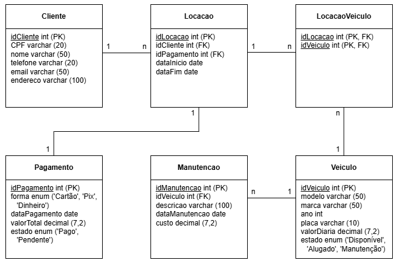

# 🚗 Locadora de Veículos

Projeto de modelagem e implementação de banco de dados para uma locadora de veículos.

## 📚 Sobre o projeto

Este projeto foi desenvolvido como atividade acadêmica para a disciplina de **Banco de Dados**, no curso de graduação da **Uninter**. O objetivo é demonstrar a capacidade de **modelar**, **criar** e **popular** um banco de dados relacional utilizando a linguagem SQL.

> 🔧 Projeto acadêmico desenvolvido por **Pedro Feld**.

---

## 💾 Tecnologias utilizadas

- **MySQL** / **pgAdmin 4**
- **Workbench** / **DBeaver** (ferramentas de apoio para execução dos scripts SQL)

---

## 🧩 Estrutura do banco de dados

O banco de dados foi modelado a partir de um **Diagrama Entidade-Relacionamento (DER)** e contém as seguintes entidades principais:

- `Cliente`
- `Veiculo`
- `Locacao`
- `Pagamento`
- `Manutencao`
- `LocacaoVeiculo` (tabela associativa)

Inclui **tipos ENUM**, **chaves primárias**, **chaves estrangeiras** e **relacionamentos 1:N e N:N**.

---

## 📂 Conteúdo do projeto

- `create_database.sql` → criação e uso do banco de dados;
- `create_tables.sql` → criação das tabelas com seus respectivos relacionamentos e restrições;
- `insert_data.sql` → inserção de dados fictícios nas tabelas;
- `queries.sql` → consultas SQL para análise e extração de informações do banco;
- `modelo_relacional_locadora_de_veiculos.png` → imagem do diagrama de relacionamento utilizado como base.

---

### 🖼️ Diagrama ER (Entidade-Relacionamento)

---

## 📊 Exemplos de consultas incluídas

- Listagem de manutenções realizadas em veículos
- Soma total de valores arrecadados com os pagamentos
- Quantidade de locações por modelo de veículo
- Lista de clientes com pagamentos pendentes

---

## 📌 Como executar

1. Clone ou baixe este repositório;
2. Abra seu gerenciador de banco de dados (DBeaver, MySQL Workbench, etc);
3. Execute os scripts `create_database.sql`, `create_tables.sql` e `insert_data.sql`;
4. Rode as consultas no `queries.sql` para ver os resultados.

---

## 📎 Licença

Este projeto foi desenvolvido para fins educacionais e acadêmicos. Fique à vontade para estudá-lo e adaptá-lo conforme necessário.

---

Feito por Pedro Feld